# Research Paper Writing Seminar I (RPW1)

## Session 01: Introduction to RPW1
### AY 2026, S2 (Q3 and Q4)

RPW1 Team
University of Aizu

<!-- Source: AY2025_lect1 - intro.pptx. Adapted for AY2026.
Teaching team, topic plan, and grading split checked against the AY2026 syllabus on 2026-10-02:
https://web-ext.u-aizu.ac.jp/official/curriculum/syllabus/2026_2_E_008.html
Confirm class dates, ELMS activities, and detailed assessment rules before class.
-->

---

# Agenda

- Course overview
- Research papers and why we write them
- The research and writing process
- Peer review and revision
- Q&A and recap

---

# Our university motto

**to Advance Knowledge for Humanity**

Our founding principle calls us to **invent** and **discover** for the peace and prosperity of humankind.

<!-- Source: https://u-aizu.ac.jp/en/intro/ (checked 2026-10-02). The explanation is a paraphrase. -->

---

# My personal take

- We are here to invent new technologies, discover useful things, and create real value for our local community and the world.
- We are NOT here simply to publish as many papers as possible.
- **Papers are a way to communicate our discoveries — not the ultimate goal of our research.**

---

# Teaching team

The AY2026 teaching team includes:

- KACHI Yasuyuki: Mathematics
- ROY Debopriyo: Linguistics
- VIGLIETTA Giovanni: Theory of Informatics
- NASSANI Alaeddin: Augmented Reality
- DANG Nam Khanh: Computer Architecture

**We also have several invited lecturers!**

---

# RPW1 Survey

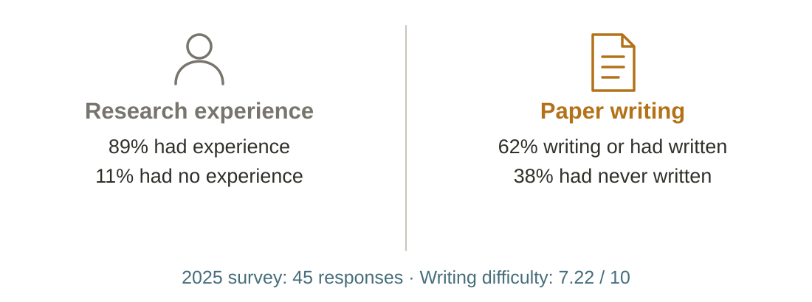

These results describe the 2025 class.

<!--
Presenter notes

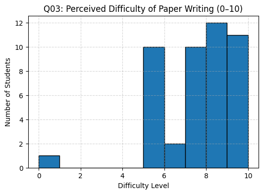

**2025 survey: 45 responses**

- 89% had research experience.
- 62% were writing or had written a paper.
- Average writing difficulty: **7.22 out of 10**.

These results describe last year’s class.

Source: 2025 PowerPoint, slide 5. Do not relabel these as 2026 results.
-->

---

# RPW1 Survey: goals and support

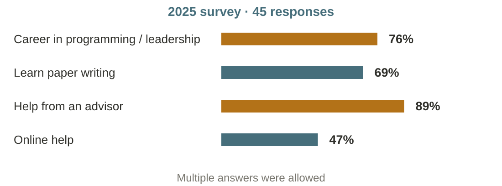

These results describe the 2025 class.

<!--
Presenter notes

**2025 survey: 45 responses**

- 76% selected a programmer, engineer, leader, or manager career.
- 69% chose RPW1 to learn more about paper writing.
- 89% received writing help from an advisor.
- 47% used online help.

Students could select more than one answer.

Source: slides 5–6. Career choices and support categories overlap.
-->

---

# Common writing difficulties

- Explaining an idea clearly
- Organizing sections and connecting ideas
- Academic English and word choice
- Choosing a research topic
- Reviewing related work
- Using LaTeX

---

# Course goals

<!-- 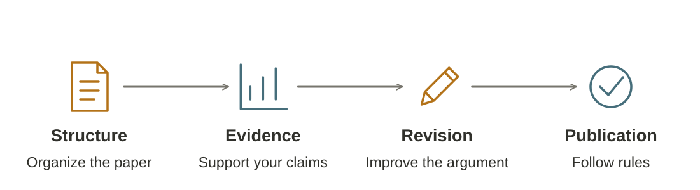 -->
### What RPW1 covers

- Understand the structure of a research paper.
- Develop skills for research paper writing.
- Learn citation, submission, and ethical writing practices.

### Course scope
- Your supervisor guides your research.
- RPW1 focuses on scientific writing. General English study is separate.

---

# Research fields

The course uses examples from computer science and engineering.

- Computer systems and networks
- Security, software, and databases
- Theory and algorithms
- AI, graphics, and multimedia
- Human–computer interaction
- Other areas of computer science and engineering

---

# Course plan: Sessions 01–06

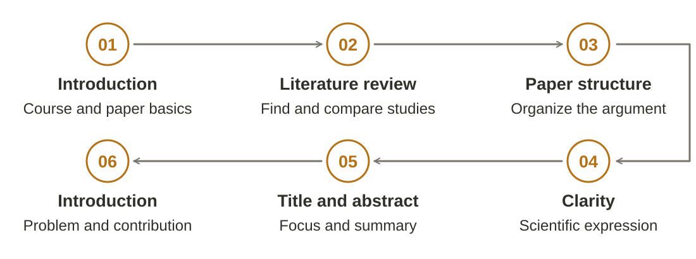

Check ELMS for the confirmed order and dates. Topics and dates may change.

<!--
Presenter notes

| Session | Topic |
| --- | --- |
| 01 | Introduction to RPW1 |
| 02 | Literature survey and review |
| 03 | Paper structure and organization |
| 04 | Scientific expression and clarity |
| 05 | Title and abstract |
| 06 | Introduction |

Check ELMS for the confirmed 2026 order and dates.

Topic plan verified against the AY2026 syllabus (checked 2026-10-02).
https://web-ext.u-aizu.ac.jp/official/curriculum/syllabus/2026_2_E_008.html
Instructor assignments and class dates are announced in ELMS.
-->

---

# Course plan: Sessions 07–14

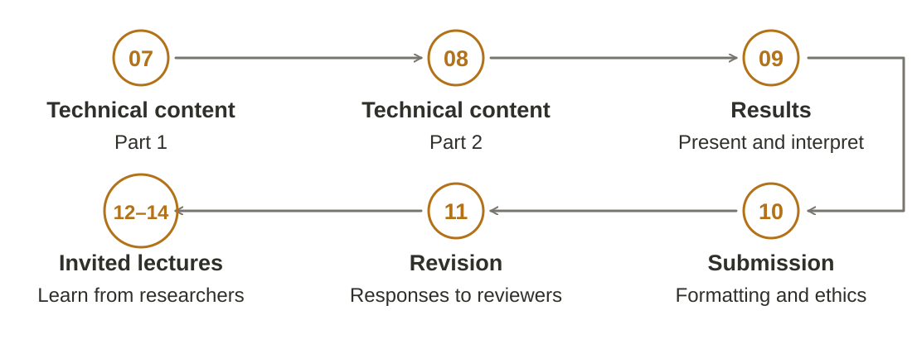

Check ELMS for the confirmed order and dates. Topics and dates may change.

<!--
Presenter notes

| Session | Topic |
| --- | --- |
| 07–08 | Technical content |
| 09 | Results and interpretation |
| 10 | Formatting, submission, and ethics |
| 11 | Revision and responses to reviewers |
| 12–14 | Invited lectures |

Topics and dates may change with instructor availability.

Topic plan verified against the AY2026 syllabus (checked 2026-10-02).
https://web-ext.u-aizu.ac.jp/official/curriculum/syllabus/2026_2_E_008.html
This is a topic plan, not a timetable with confirmed class dates.
-->

---

# Course information in ELMS

Use the **AY2026 RPW1 ELMS course page** for:

- Class dates, rooms, and schedule changes
- Attendance and grading rules
- Plagiarism and generative AI rules
- Slides, questionnaires, and assignments

Planned class time: periods 9–10, **17:00–18:40**, on Monday, Tuesday, or Wednesday.
Check ELMS and your email for the date of each class and any changes.

<!--
Presenter notes

Use the **AY2026 RPW1 course page** for:

- Class dates, rooms, and schedule changes
- Attendance and grading rules
- Plagiarism and generative AI rules
- Slides, questionnaires, and assignments

Planned class time: periods 9–10, **17:00–18:40**, on Monday, Tuesday, or Wednesday.
Check ELMS and your email for the date of each class and any changes.

The working deck supplies the planned time. Specific AY2026 class dates must be checked in ELMS.
Old activity URLs are intentionally omitted.
-->

---

# Midterm and final assignment

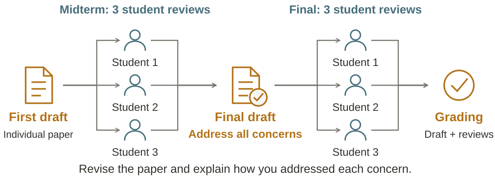

**Your final draft must address concerns from all three midterm reviewers.**

<!--
Presenter notes

AY2026 assignment flow:
1. Each student writes an individual paper draft.
2. At midterm, three students review each draft independently.
3. The author reads all three reviews and revises the paper for the final submission.
4. The final draft must address every concern. Explain the changes made. If you disagree with a concern, explain why and support your response with evidence.
5. Three students review each final draft in the final review round.
6. Instructors grade both the paper drafts and the student reviews.

Ask students: How will you check that you have addressed comments from all three reviewers?
-->

---

# Individual work and course rules

The AY2026 rules are posted on ELMS:

- Individual authorship and permitted help
- Citation and reuse of research material
- Generative AI use and disclosure
- Submission format and review responsibilities

Ask the instructors if a rule is unclear.

---

# Grading

- **50%: Class activities**, including your peer reviews
- **50%: Paper draft**, with midterm and final rounds

Check ELMS for the detailed rubric and deadlines.

<!-- The 50/50 split is confirmed by the AY2026 syllabus. The working deck supplies the review rounds.
Source: https://web-ext.u-aizu.ac.jp/official/curriculum/syllabus/2026_2_E_008.html (checked 2026-10-02).
-->

---

# Session 01: Q&A and survey

- Open ELMS: [https://elms.u-aizu.ac.jp/](https://elms.u-aizu.ac.jp/)
- Please complete the questionnaire in 10 minutes.
- The survey closes at **17:50**.

<!--
Presenter notes

Open [ELMS](https://elms.u-aizu.ac.jp/) and find **RPW1, AY2026**.

Answer the Session 01 questionnaire, if available.

- What research experience do you have?
- Have you written a paper before?
- What is difficult about paper writing?
- What would you like to learn?

Allow about 10 minutes. Confirm the 17:50 closing time in ELMS before class.

-->

---

# What is a research paper?

---

# Common types of research papers

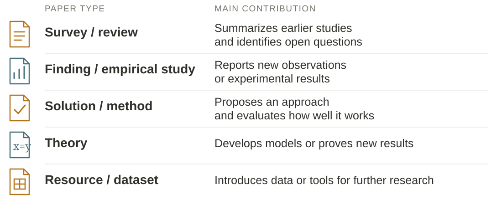

<!-- Paper types can overlap. Each has a main contribution.  -->

---

# What a research paper explains

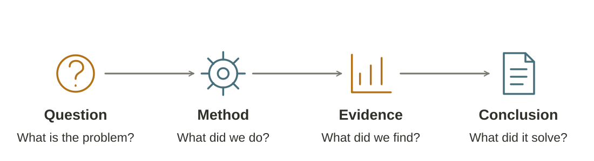

- What problem the research addresses
- How the work relates to earlier studies
- What the authors did
- What evidence supports the conclusions
- What limits remain

<!--
Presenter notes

A research paper explains a question and what the authors learned.

It tells readers:

- What problem the research addresses
- How the work relates to earlier studies
- What the authors did
- What evidence supports the conclusions
- What limits remain

-->

---

# Example: A systems paper

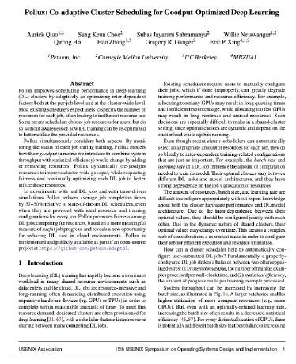

[*Pollux: Co-adaptive Cluster Scheduling for Goodput-Optimized Deep Learning*](https://www.usenix.org/conference/osdi21/presentation/qiao)

The first page includes a title, authors, abstract, and introduction.

How does the abstract explain the problem and result?

<!-- Source slide 15, image4.emf. PNG conversion with blank margins cropped.
Paper: https://www.usenix.org/conference/osdi21/presentation/qiao
-->

---

# Example: A machine learning paper

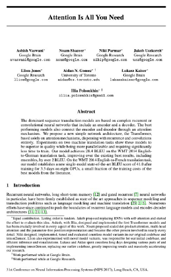

[*Attention Is All You Need*](https://papers.neurips.cc/paper/7181-attention-is-all-you-need.pdf)

Look at the title, author list, abstract, and section headings.

How do they help you find the main idea?

<!-- Source slide 15, image5.emf. PNG conversion with blank margins cropped.
Paper: https://papers.neurips.cc/paper/7181-attention-is-all-you-need.pdf
-->

---

# Why RPW1?

---

# Why research writing matters

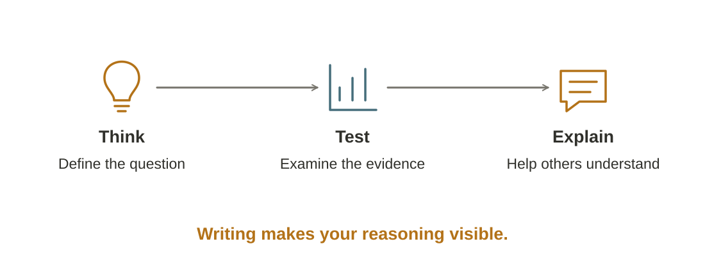

<!--
Presenter notes

Writing helps you examine your own reasoning.

- A clear question helps you plan useful experiments.
- A clear method helps others understand your work.
- Evidence helps readers judge your conclusions.
- Good explanations help you share results at work or in research.

Writing is part of thinking about the problem.

-->

---

# Why RPW1 in the era of LLMs?

- Large language models (LLMs) can help draft and revise text.

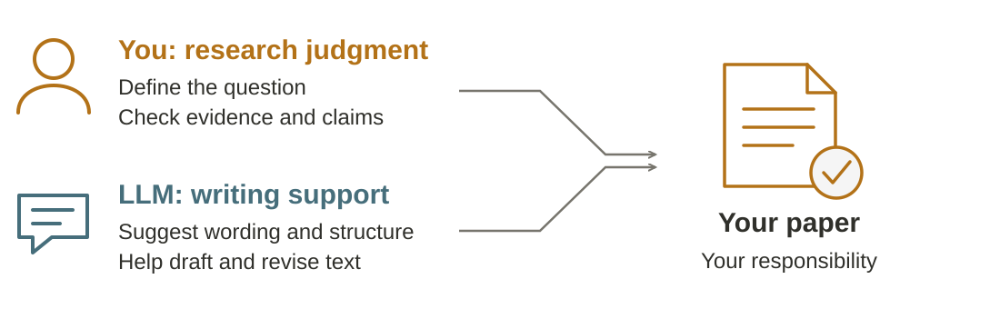

- **You need to build and check a clear research argument.**

<!-- LLM means large language model. Ask: If an LLM writes a convincing sentence,
what evidence would you need before including it in your paper? -->

---

# Benefits of research writing

Academic:
- Develops analytical thinking and study design skills.
- Deepens understanding of the research topic.
- Improves how you explain methods and results.

Professional:
- Helps you communicate your expertise.
- Supports preparation for academic and industrial R&D roles.

Personal:
- Encourages intellectual curiosity.

---

# Skills you can use beyond RPW1

- **Write a research paper**
- Explain your work in a job interview
- Describe an invention in a patent application
- Write a funding proposal
- Pitch an idea for a startup

---

# Example: LLM training costs

**Manager:** “Training our large language model costs too much.”

Possible replies:

- “Buy cheaper GPUs.”
- “Rent cheaper computing resources.”
- “Measure the costs first.”
- “Reduce our salaries!”

Which reply helps us understand the problem?
<!--
Presenter notes

**Manager:** “Training our large language model costs too much.”

Possible replies:

- “Buy cheaper GPUs.”
- “Rent cheaper computing resources.”
- “Measure the costs first.”
- “Reduce our salaries!”

Which reply helps us understand the problem?

Adapted from source slides 19–21. Illustration: Irasutoya, as credited in the source. This is a teaching scenario.
-->

---

# Defining the research problem

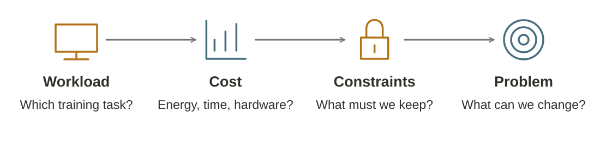

The problem must be **clearly defined.**

<!--
Presenter notes

“Training costs too much” is broad.

First ask:

- Which training workload are we studying?
- What costs are high: hardware, electricity, or time?
- What can we change?
- What performance must we keep?

Measurements help us choose a specific problem.

Adapted from slides 22–24. Illustration: Irasutoya.
-->

---

# Evidence from earlier work

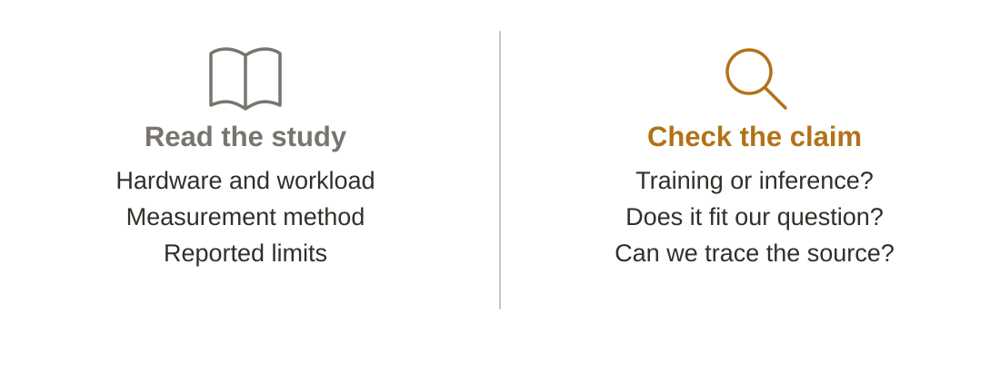

A trusted source still needs **careful reading**.

<!--
Presenter notes

A literature review helps us learn what others have tried.

For the training-cost example:

- Find studies about training energy and performance.
- Separate **training** from **inference**.
- Check the hardware, workload, and measurement method.
- Record the source of each claim.

A trusted source still needs careful reading.

Source slides 25–30 mix training and inference and assert an unsupported DVFS research gap. Those claims and energy figures are not carried forward.
-->

---

# A focused research question

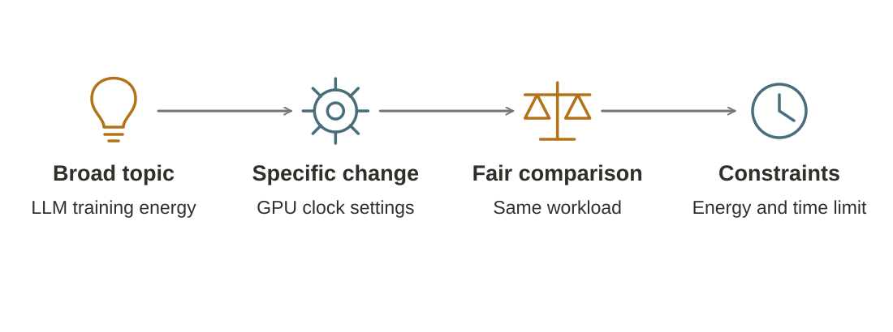

Example research question:
- **Can GPU clock settings reduce training energy within a time limit?**

<!--
Presenter notes

**Broad topic:** Energy use in LLM training

**Possible question:**
Can changing GPU clock settings reduce energy use for a selected
training workload while keeping training time within a set limit?

Define the workload and the time limit before testing.
Check earlier work before claiming a new contribution.

Hypothetical question adapted from slides 27–31. DVFS means dynamic voltage and frequency scaling. No claim that this topic is new.
-->

---

# A method and a fair test

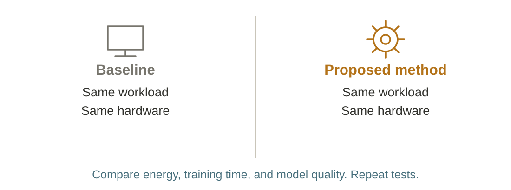

<!-- Explain where the method helps or fails. -->

<!--
Presenter notes

For this example, we would:

1. Describe the proposed clock-setting method.
2. Compare it with a clear baseline.
3. Measure energy, training time, and model quality.
4. Repeat tests and report variation.

Explain the conditions where the method helps or fails.

Teaching scenario adapted from slides 32–35. Illustration: Irasutoya. The source's 20% savings and $1 million estimate were fictional and are omitted.
-->

---

# Reporting the result

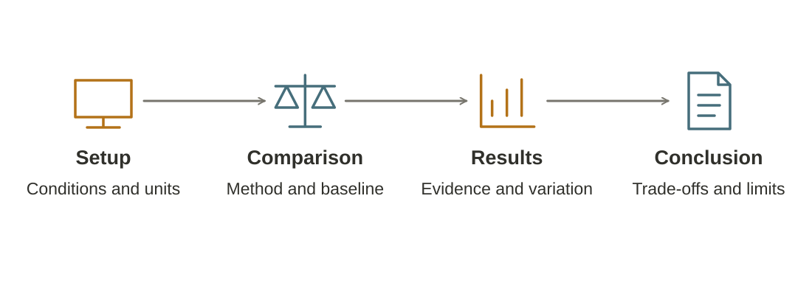

<!-- Keep the conclusion within the evidence. -->

<!--
Presenter notes

A useful report connects the question to the evidence.

- State the experimental setup.
- Explain the method and comparison.
- Show results with clear units and labels.
- Explain trade-offs and limits.
- Keep the conclusion within the evidence.

A strong claim needs strong support.

Adapted from slides 33–36.
-->

---

# The research and writing process

---

# The research and writing process

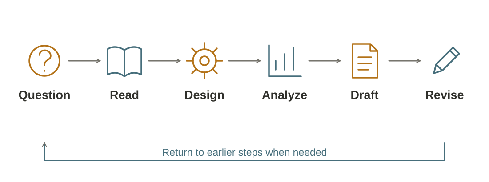

<!--
Presenter notes

1. Choose a topic and define a question.
2. Read related research.
3. Design a method and an evaluation.
4. Collect and analyze evidence.
5. Write a draft.
6. Revise and prepare for submission.

You may return to earlier steps as you learn more.

-->

---

# A useful research question

A useful question is:

- Clear enough for readers to understand
- Narrow enough for the planned study
- Possible to answer with available resources
- Important to the research community

Example:
- Weak: How does AI improve healthcare?
- Better: How does image augmentation affect a fixed model’s COVID-19 classification accuracy on a held-out chest X-ray test set?

<!--
Presenter notes

A useful question is:

- Clear enough for readers to understand
- Narrow enough for the planned study
- Possible to answer with available resources
- Important to the research community

**Activity:** Write one question about your own research.
What evidence would answer it?

The narrower example still needs a specified model, dataset, augmentation method,
baseline, and evaluation protocol. It is a hypothetical study, not a medical claim.

-->

---

# Literature review

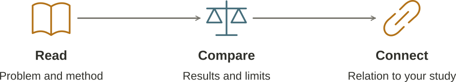

- Explain how earlier work relates to your question.
- Identify existing research gaps.
- Support the development of your methodology.

> We will cover this in Session 02.

<!--
Presenter notes

A literature review explains how earlier work relates to your question.

For each relevant paper, record:

- The problem and main idea
- The method and evaluation
- The result and its limits
- How it relates to your study

Compare papers. Explain the differences between them.

-->

---

# Finding relevant papers

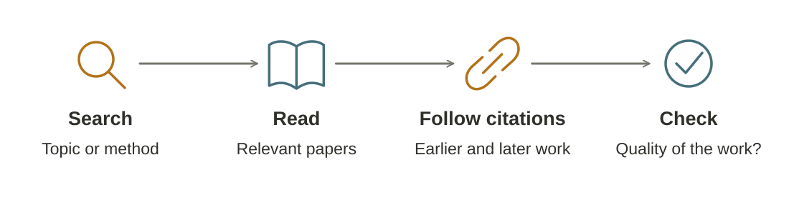

[Google Scholar](https://scholar.google.com/) · [IEEE Xplore](https://ieeexplore.ieee.org/) · [ACM DL](https://dl.acm.org/) · [arXiv](https://arxiv.org/)

AI search tools can help. Verify papers and references against the original sources.

> We will cover this in Session 02.

<!--
Presenter notes

Search by topic, method, or research question.

- [Google Scholar](https://scholar.google.com/)
- [IEEE Xplore](https://ieeexplore.ieee.org/)
- [ACM Digital Library](https://dl.acm.org/)
- [arXiv](https://arxiv.org/)

Follow references and papers that cite a useful study.
Check whether a paper has completed peer review.

-->

---

# Paper structure

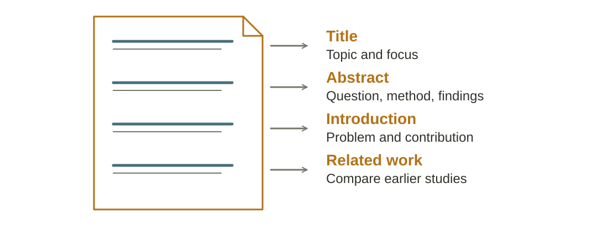

Section names and order vary by field and venue.

<!--
Presenter notes

| Section | Main purpose |
| --- | --- |
| Title | Name the topic and focus |
| Abstract | Summarize the question, method, and findings |
| Introduction | Explain the problem and contribution |
| Related work | Compare relevant earlier studies |

Section names and order depend on the field and venue.

-->

---

# Paper structure (continued)

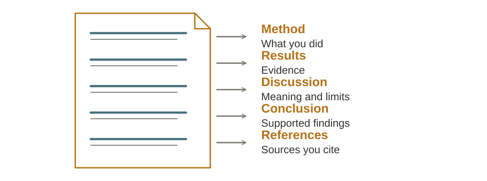

Some papers combine sections or use different names.

<!--
Presenter notes

| Section | Main purpose |
| --- | --- |
| Method or technical content | Explain what you did |
| Results | Present the evidence |
| Discussion | Interpret results and explain limits |
| Conclusion | State what the study supports |
| References | Identify the sources you cite |

Some papers combine sections or use different names.

-->

---

# Citations and plagiarism

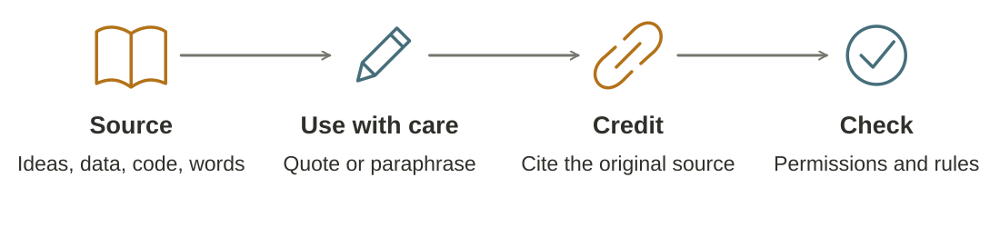

- Cite your own previous work when you reuse or extend it.
- Be cautious of AI hallucinations, and verify AI-generated claims and references.
- Check permissions before reproducing figures, tables, or text.

<!--
Presenter notes

Give credit when you use another person’s words or work.

- Cite ideas, results, figures, data, and code that you use.
- Mark exact wording as a quotation and cite it.
- Use your own wording when you paraphrase, and still cite the source.
- Cite earlier work of your own when you reuse or extend it.

Check permissions and publication rules when reusing material.

Source: https://journals.ieeeauthorcenter.ieee.org/become-an-ieee-journal-author/publishing-ethics/guidelines-and-policies/submission-and-peer-review-policies/ (checked 2026-10-01). Adapted from source slide 43.
-->

---

# Writing tools and generative AI

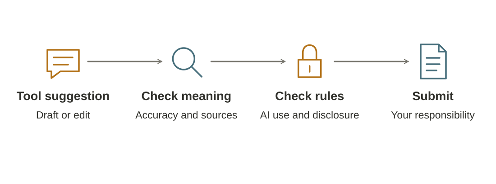

**You remain responsible for the work you submit.**

<!--
Presenter notes

Tools can help with drafting, formatting, and language.

- Check every suggested change for meaning and accuracy.
- Verify references against the actual source.
- Follow the course and venue rules for AI use and disclosure.
- Protect private and confidential material.

You remain responsible for the work you submit.

Course policy is available in AY2026 ELMS and was not provided here.
Publisher reference: https://journals.ieeeauthorcenter.ieee.org/become-an-ieee-journal-author/publishing-ethics/guidelines-and-policies/submission-and-peer-review-policies/ (checked 2026-10-01).
-->

---
# Revision

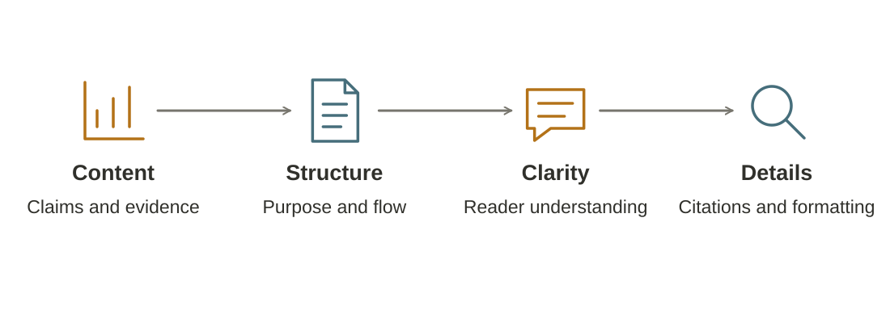

Ask a reader to explain your main point back to you.

<!--
Presenter notes

Revise in separate passes:

1. **Content:** Does the evidence support the claims?
2. **Structure:** Does each section serve a clear purpose?
3. **Clarity:** Can readers follow the explanation?
4. **Details:** Are citations, labels, spelling, and formatting correct?

Ask a reader to explain your main point back to you.

-->

---

# Common problems in a draft

- A broad problem with no clear research question
- A contribution that readers cannot identify
- Claims without enough evidence
- A list of papers without comparison or analysis
- Figures or explanations that are hard to follow
- Missing citations or incorrect formatting

Fix the main argument before polishing individual sentences.

---

# Writing and reference tools

| Task | Tools |
| --- | --- |
| Writing and formatting | Word, LaTeX, Overleaf |
| Managing references | Zotero, JabRef, Mendeley |
| Drafting and revision support | LLMs, where permitted |
| Similarity checking | Turnitin, iThenticate |
| Grammar check | Grammarly |

Choose tools that fit your supervisor’s workflow and the venue.
Check the output yourself.

<!-- A similarity score requires interpretation. It does not by itself establish plagiarism.
Generative AI use depends on course and venue rules.
-->

---

# How will your papers be reviewed?

---

# Peer review

**Peer review** asks other researchers to assess a paper’s quality and validity.

1. **Initial screening: editorial office and editor / chair**
   - The office checks format and required information.
   - The editor or chair checks scope and suitability for review.
   - The paper may be returned for corrections or **rejected before review**.

2. **Handling editor / area or track chair**
   - Assigns reviewers and manages the review process.
   - Considers reports and recommends or makes a decision.

---

# Peer review (continued)

3. **Reviewers**
   - Are invited to evaluate the paper.
   - Assess its novelty, technical quality, clarity, and significance.
   - Are usually anonymous, depending on the venue's review policy.

4. **Decision authority: editor or program committee leadership**
   - Considers the paper, review reports, and recommendations.
   - Makes or approves the **final decision**, under the venue’s policy.

Roles and decision authority vary by venue.

<!-- TPC means technical program committee. Reviewers advise; editors or conference leadership decide.
Sources (checked 2026-10-02):
https://journals.ieeeauthorcenter.ieee.org/submit-your-article-for-peer-review/about-the-peer-review-process/
https://journals.ieeeauthorcenter.ieee.org/submit-your-article-for-peer-review/understanding-the-decision-process/
-->

---

# Before submission

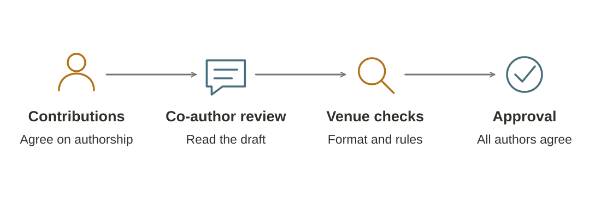

---

# Submission and review

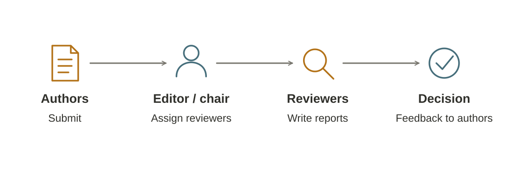

The number of reviewers and steps depend on the venue.

<!--
Presenter notes

1. Authors submit the manuscript.
2. The editor or chair checks it and assigns reviewers.
3. Reviewers read the paper and write reports.
4. The editor or committee considers the reports.
5. Authors receive a decision and feedback.

The number of reviewers and steps depend on the venue.

Adapted from slides 48, 52–55.
Source: https://journals.ieeeauthorcenter.ieee.org/submit-your-article-for-peer-review/about-the-peer-review-process/ (checked 2026-10-01).
-->

---

# Anonymous review and conflicts

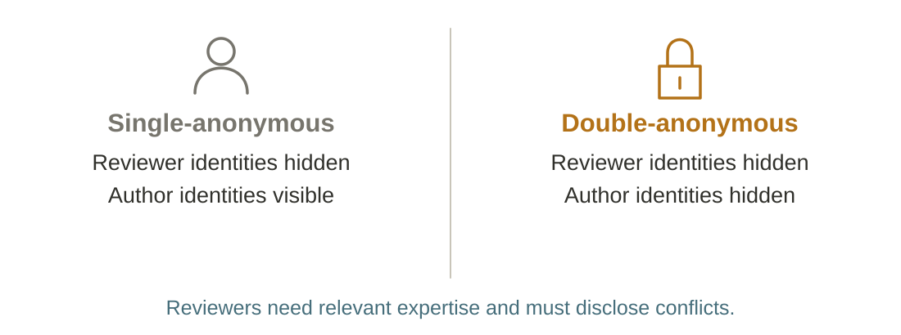

<!-- Follow the venue’s specific rules. -->

<!--
Presenter notes

Review procedures differ by venue.

- In single-anonymous review, authors do not know reviewer names.
- In double-anonymous review, both sides’ identities are hidden.
- Reviewers should disclose conflicts of interest.
- Reviewers should have relevant expertise.

Follow the venue’s rules for anonymity and conflicts.

Adapted from slides 53, 65–66. No universal 5–10-year co-authorship rule.
Source: https://journals.ieeeauthorcenter.ieee.org/submit-your-article-for-peer-review/about-the-peer-review-process/ (checked 2026-10-01).
-->

---

# Possible decisions

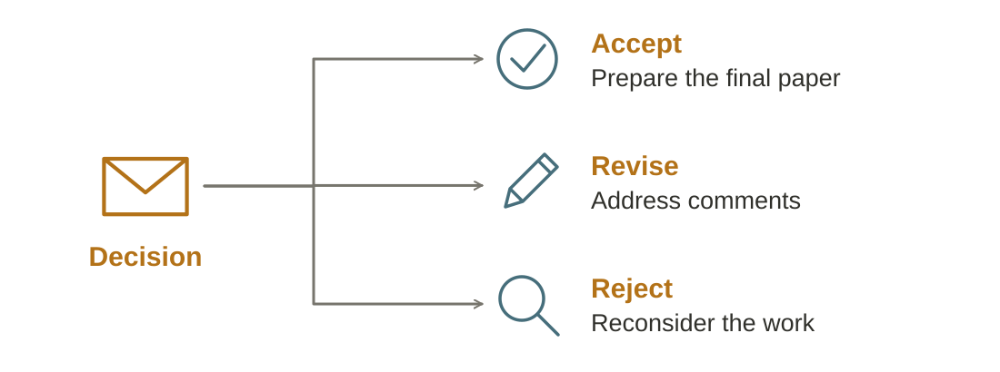

**A request for revision or an author response does not guarantee acceptance.**

<!--
Presenter notes

| Decision | Meaning |
| --- | --- |
| Accept | Follow the final submission instructions |
| Revise | Address comments and submit a revised version |
| Reject | The venue will not publish this version |

A revision request does not guarantee acceptance.
Some conferences offer a response or revision stage.
Check the specific procedure.

Adapted from source slides 54–64.
-->

---

# Responding to reviews

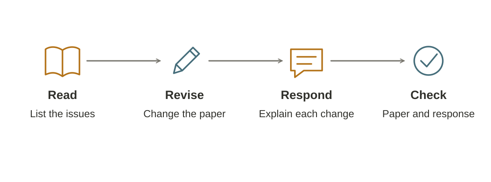

Support disagreements with reasons and evidence.

<!--
Presenter notes

Read the comments carefully before replying.

1. List each issue and plan a response.
2. Revise the paper where needed.
3. Explain the change and where it appears.
4. Support disagreements with reasons and evidence.
5. Check the response and manuscript together.

Use a calm, respectful tone.

-->

---

# A useful review

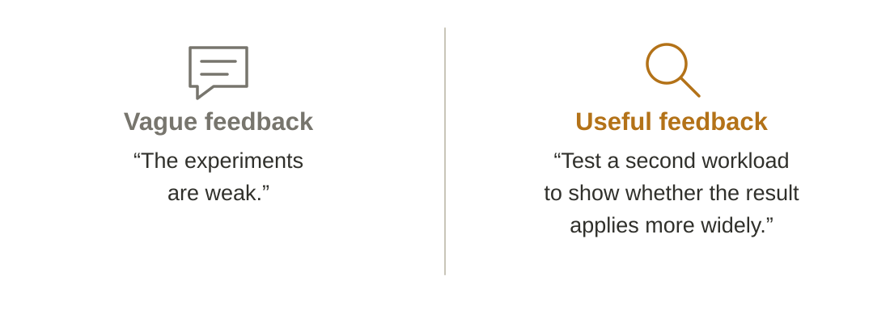

Be specific, fair, and constructive. Keep reviews confidential.

<!--
Presenter notes

A useful reviewer explains both strengths and weaknesses.

**Vague:** “The experiments are weak.”

**Useful:** “The paper tests one workload. A second workload would
help readers judge whether the result applies more widely.”

Be specific, fair, and constructive.
Keep review material confidential.

Adapted from slides 67–68.
Source: https://journals.ieeeauthorcenter.ieee.org/submit-your-article-for-peer-review/become-an-ieee-reviewer/ (checked 2026-10-01).
-->
---

# Reviewers and decision makers

- Reviewers are usually experts in the specific research field.

- Editors and program committee chairs
    - Have broad knowledge of the research area.
    - May not be experts in every specific topic.
    - Usually give significant consideration to the reviewers' recommendations when making the final decision.

> Revision and rebuttal: we will cover this in Session 11.

---

# Peer review: overall flow

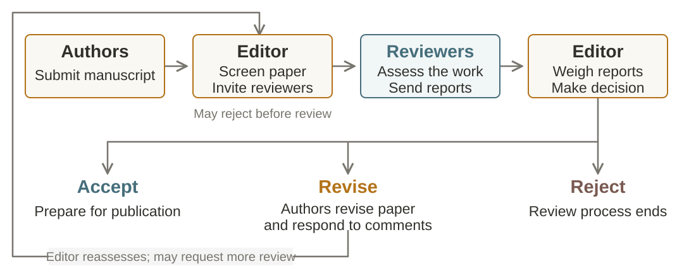

Typical journal process. Conference review may have fewer revision rounds.

<!--
Presenter notes

Reviewers advise. The editor makes the decision, sometimes under the oversight
of the Editor-in-Chief. Initial screening can lead to rejection before external review.
Revisions may go back to reviewers or be assessed by the editor.
For conferences, area chairs and program committee chairs may handle these roles.
Many conferences do not offer a revision round.

Sources:
https://journals.ieeeauthorcenter.ieee.org/submit-your-article-for-peer-review/about-the-peer-review-process/
https://journals.ieeeauthorcenter.ieee.org/submit-your-article-for-peer-review/understanding-the-decision-process/
https://conferences.ieeeauthorcenter.ieee.org/understand-peer-review/
-->

---

# Some modest suggestions

---

# Clear scientific writing

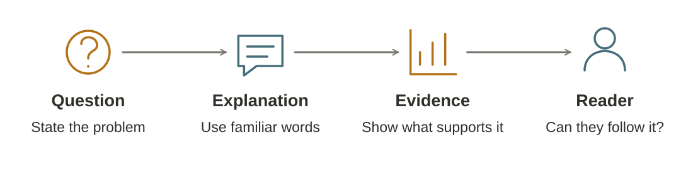

- Precision matters more than impressive language.
- Clear explanations help busy editors and reviewers assess your work.
- Readers need to understand the contribution and its supporting evidence.
<!--
Presenter notes

Readers need to understand your question and evidence.

- Prefer familiar words when they express the meaning well.
- Define technical terms when readers need them.
- Give each paragraph one main point.
- Use examples and figures to explain difficult ideas.

Precision matters more than impressive language.

-->

---

# A precise sentence

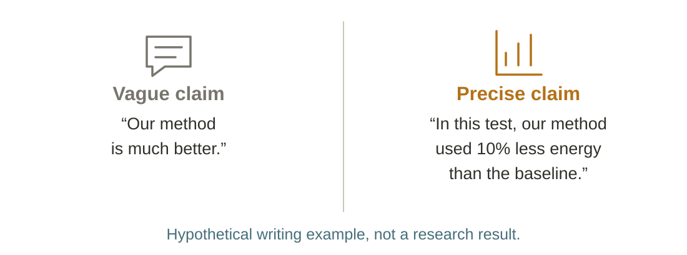

Explain the workload, measurement method, and variation.

<!--
Presenter notes

**Vague:** “Our method is much better.”

**More precise:** “In this test, our method used 10% less energy
than the baseline.”

Then explain the workload, measurement method, and variation.

The number here is a writing example, not a research result.

Replaces unsupported numerical claims in the source with an explicitly hypothetical example.
-->

---

# Writing for your readers

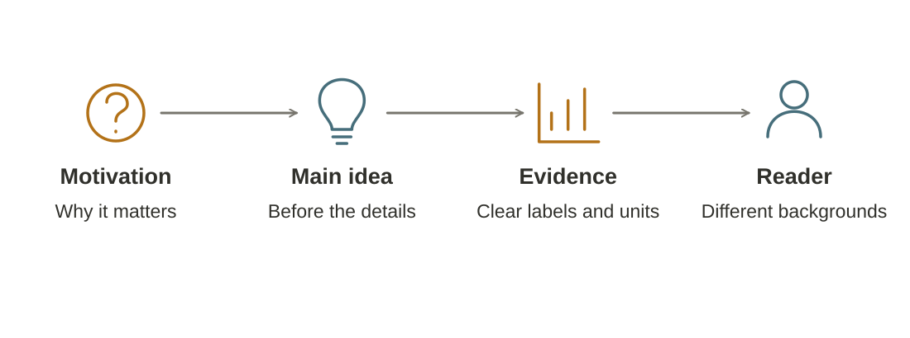

<!-- Use consistent names and symbols. -->

<!--
Presenter notes

Readers have different backgrounds and levels of English.

- Explain why the problem matters.
- Introduce the idea before the details.
- Use consistent names and symbols.
- Label figures, axes, and units clearly.
- Keep the main result easy to find.

A reader should not need to guess what you mean.

-->

---

# Conferences and journals

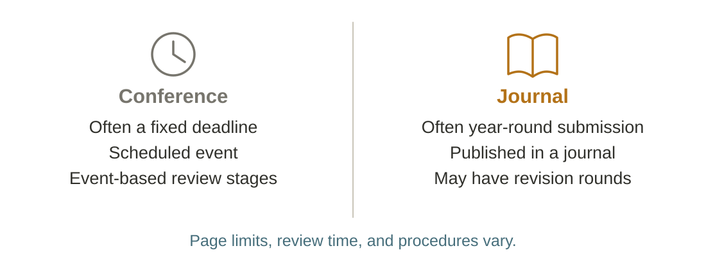

Read the current venue instructions.

<!--
Presenter notes

| Conference | Journal |
| --- | --- |
| Often has a fixed submission deadline | Often accepts submissions throughout the year |
| Papers connect to a scheduled event | Papers appear in a journal |
| Review stages follow the event schedule | Review may include several revision rounds |

Page limits, review time, and revision rules vary.
Read the current instructions for the venue.

Adapted from slides 77–78. Removed universal page counts and fixed review times.
-->

---

# Choosing a publication venue

Discuss the choice with your supervisor.

- Does the venue publish work on your topic?
- Who is the intended audience?
- Are the review process and publisher clear?
- Can you meet the format and deadline?
- Are publication costs and policies acceptable?

Use rankings as one source of information.
Read recent papers and assess their relevance.

---

# Learning from published papers

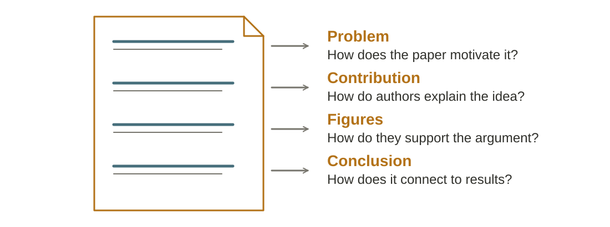

Learn from the structure. Write your own explanation.

<!--
Presenter notes

Choose a well-written paper in your field.

Look for:

- How the introduction defines the problem
- How the authors explain their contribution
- How figures support the argument
- How the conclusion connects to the results

Learn from the structure. Write your own explanation.

-->

---

# Venue rankings and citation metrics

- Computing venue lists: [ICORE (formerly CORE)](https://portal.core.edu.au/conf-ranks/) and CCF
- Journal indicators: SCImago Journal Rank and Journal Impact Factor
- Publication citation metrics: [Google Scholar Metrics](https://scholar.google.com/intl/en/scholar/metrics.html)

These indicators provide context. They do not establish the quality of an individual paper.

**Read the papers and discuss venue choices with your supervisor.**

<!-- Sources (checked 2026-10-02):
https://portal.core.edu.au/conf-ranks/
https://scholar.google.com/intl/en/scholar/metrics.html
https://sfdora.org/read/
Journal Impact Factor is a journal metric. Assess each paper's methods, evidence, and relevance.
-->

---

# Q&A time

---

# Questions and review

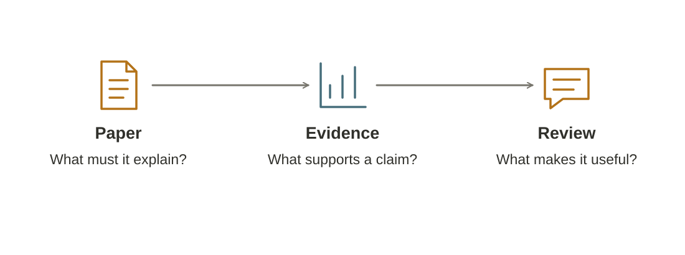

---

# What would you like to ask about the course?

<!--
Presenter notes

- What does a research paper need to explain?
- How does evidence support a claim?
- What makes a review useful?
- What would you like to ask about the course?

Source slide 85.
-->

---

# Four points to remember

- Be precise.
- Use simple language.
- Improve the paper through revision.
- Focus on quality rather than quantity.

---

# to Advance Knowledge for Humanity

Our founding principle calls us to **invent** and **discover** for the peace and prosperity of humankind.

<!--
Presenter notes

Source for the motto and its meaning: https://u-aizu.ac.jp/en/intro/ (checked 2026-10-02).

Preparation for Session 02:

Open the **AY2026 RPW1 course in ELMS**.

- Read the preparation assignment and its deadline.
- Check the next class date.
- Prepare a research topic or question for the literature review.

Bring questions about finding and reading related papers.

Source slide 88 refers to a 2025 assignment URL. Use the current activity.
The research-topic preparation is a suggested class preparation, not a new graded requirement.
-->

---

# Thank you

## Questions?

Research Paper Writing Seminar I (RPW1)
Session 01, AY2026

Next topic: Literature survey and review
