<!-- _class: center-title -->
<!-- _footer: "" -->
<!-- _paginate: false -->

# Literature Survey and Review

## Session 02 · AY2026

Research Paper Writing Seminar I

Khanh N. Dang · University of Aizu

<!--
Source: AY2025_lect2 - lit. survey.pptx, slide 1.
Original slide text (historical source, not verified current guidance):
Session 2: Literature Survey and Review
Khanh N. Dang
khanh@u-aizu.ac.jp	
Oct. 14, 2025
Research Paper Writing 1 (RPW1) | AY2025 Q3&Q4
Original links:
mailto:khanh@u-aizu.ac.jp
-->

---

# Agenda

- Introduction
- Why Literature Review?
- Key steps of Literature Review
- Common methods
- Examples
- Common tools

---

# Q&A and opening survey

- Questions from Session 01?
- Open the current Session 02 survey in ELMS.
- Allow five minutes for the survey.

<!--
Source: AY2025_lect2 - lit. survey.pptx, slide 2.
Original slide text (historical source, not verified current guidance):
Q&A Time and 5 min of survey
Question for the previous session?
Please do the survey for session 2:
https://elms.u-aizu.ac.jp/mod/questionnaire/view.php?id=140788 
Monday, October 13, 2025
RPW1: Session 2
2
Original links:
https://elms.u-aizu.ac.jp/mod/questionnaire/view.php?id=140788

-->

---

# Our university motto

**to Advance Knowledge for Humanity**

Our founding principle calls us to **invent** and **discover** for the peace and prosperity of humankind.

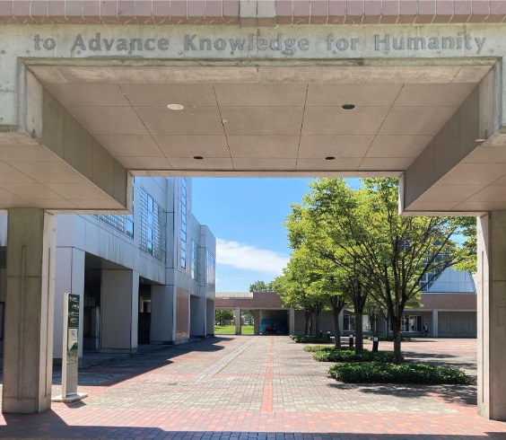

<!-- Source: https://u-aizu.ac.jp/en/intro/ (checked 2026-10-02). The explanation is a paraphrase. -->

---

# Notes

- The recordings and screenshots show tools from 2024–2025.
- Treat generated answers as examples to check.
- Read the original papers and verify meaning, claims, and references.
- Follow current course and venue policies.

<!--
Source: AY2025_lect2 - lit. survey.pptx, slide 3.
Original slide text (historical source, not verified current guidance):
Note
Examples using Generative AI (ChatGPT, Gemini, etc…) are included in this session
Screenshots are from old generations of Generative AI
Quality of answers may vary
Answers validated, but some points may be missing
Differences may exist between creation time and your usage
Examples are for demonstration purposes only
DO NOT consider Generative AI’s answers to be completely accurate
My modest recommendations: 
Generative AI is good for quickly scanning/skimming
To understand papers, please read them carefully
Monday, October 13, 2025
RPW1: Session 2
3
-->

---
<!-- _class: center-title -->
<!-- _footer: "" -->
<!-- _paginate: false -->

# Recap: What is a research paper?

---

# Common types of research papers

<!-- Paper types can overlap. Each has a main contribution.  -->

---

# What a research paper explains

- What problem the research addresses
- How the work relates to earlier studies
- What the authors did
- What evidence supports the conclusions
- What limits remain

> **Today session: finding a clear problem and how related works did**
<!--
Presenter notes

A research paper explains a question and what the authors learned.

It tells readers:

- What problem the research addresses
- How the work relates to earlier studies
- What the authors did
- What evidence supports the conclusions
- What limits remain

-->

---

# Some common mistakes

- Weak statement
- Poor structure and organization
- Lack of critical analysis.
- Failure to follow the formatting guidelines.
- IMPORTANT: no significant novelty → <mark>This week’s session</mark>

---
<!-- _class: center-title -->
<!-- _footer: "" -->
<!-- _paginate: false -->
# What is a Literature Survey?

---

# Introduction to Literature Surveys

What is a Literature Survey?
- A review of existing research related to your topic.
- Identifies trends, gaps, and patterns in existing literature.
- Forms the baseline for your own research.

Example:
- Surveying various deep learning models used in computer vision to find gaps for new contributions.

<!--
Source: AY2025_lect2 - lit. survey.pptx, slide 8.
Original slide text (historical source, not verified current guidance):
Introduction to Literature Surveys
What is a Literature Survey?
A review of existing research related to your topic.
Identifies trends, gaps, and patterns in existing literature.
Forms the baseline for your own research.
Example:
Surveying various deep learning models used in computer vision to find gaps for new contributions.
Monday, October 13, 2025
RPW1: Session 2
8
-->

---

# Why is a Literature Survey Important?

- Talking to your advisors/colleagues/lab members is not enough:
  - People are busy and usually not up to date with the state of the art.
- Establishes context for your research.
  - Without an intensive survey, we cannot make sure you have a good context of research.
- Identifies gaps in the literature that your research can fill.
  - What is the problem that hasn’t been addressed prior to your work?
- Prevents duplication of previous work.
  - <mark>Avoid “re-inventing the wheel”</mark>

<!--
Source: AY2025_lect2 - lit. survey.pptx, slide 9.
Original slide text (historical source, not verified current guidance):
Why is a Literature Survey Important?
Talking to your advisors/colleagues/lab members is not enough:
People are busy and usually not up to date with the state of the art.
Establishes context for your research.
Without an intensive survey, we cannot make sure you have a good context of research.
Identifies gaps in the literature that your research can fill.
What is the problem that hasn’t been addressed prior to your work?
Prevents duplication of previous work.
Avoid “re-inventing the wheel”
Monday, October 13, 2025
RPW1: Session 2
9
-->
---
<!-- _class: center-title -->
<!-- _footer: "" -->
<!-- _paginate: false -->
# Two key problems: (1) novelty and (2) evidence

---

# Lack of Novelty

Imagine submitting a paper that presents the Pythagorean theorem for right triangles as a new discovery.

The result is already known. **What does your paper add?**

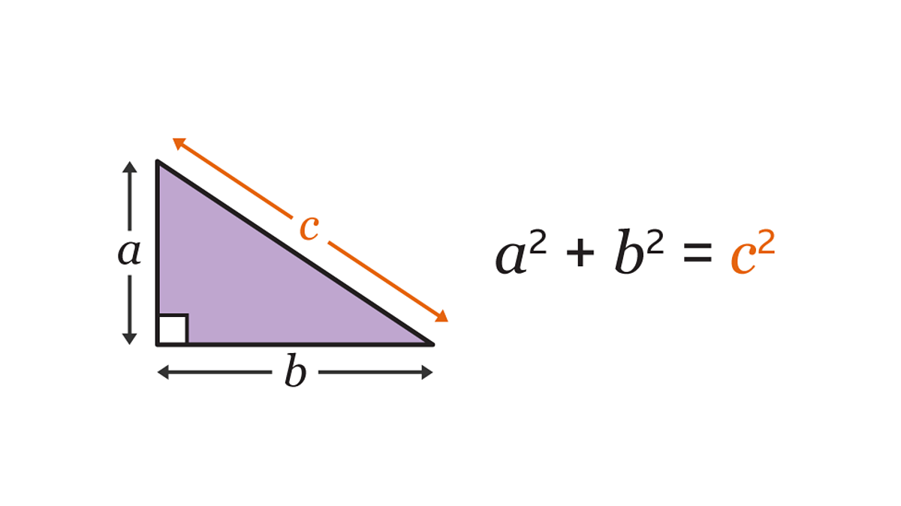

<!--
Source: AY2025_lect2 - lit. survey.pptx, slide 23.
Original slide text (historical source, not verified current guidance):
A funny analogy (cnt.)
Monday, October 13, 2025
RPW1: Session 2
23
Why rejections?
For (1), there is no point in publishing a paper if the idea is released. It is like you publish a paper about the Pythagorean theorem on right triangles.

For (2), it is not trustworthy.

 It is like I’ve never eaten any bowl of ramen in my whole life, but I cook the best ramen in the world.

Nobody will believe you.
Extracted images: images/image5.png
Hypothetical teaching analogy. Vehicle availability and specifications are not current market claims.
-->

---

# Lack of evidence

Imagine someone claiming:

> “I have never eaten a bowl of ramen in my life, but I cook the best ramen in the world.”

**Why should anyone believe this claim?**

A claim needs evidence: taste tests and comparisons with other ramen.

<!--
Source: AY2025_lect2 - lit. survey.pptx, slide 23. Hypothetical teaching analogy.
Lack of experience alone does not prove the claim false. The problem is that the speaker provides no evidence for “the best”.
Ask students: What would a fair comparison look like? Who would judge the ramen, and by which criteria?
Connect to research: support claims with appropriate experiments, measurements, and comparisons with relevant prior work.
-->

---

# Literature review and editorial screening

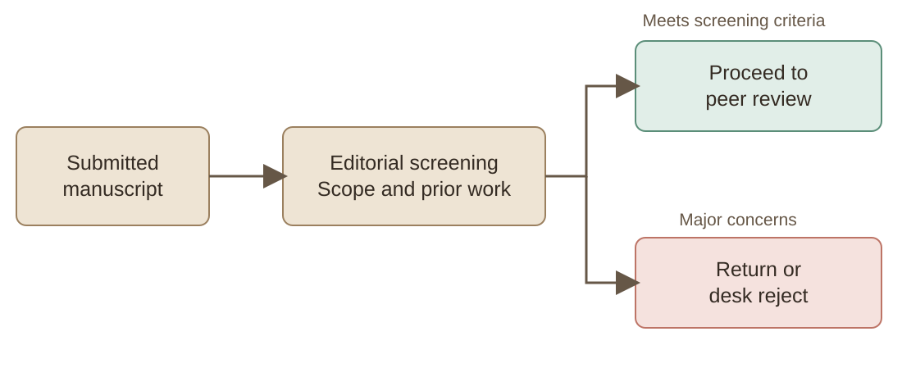

<!--
Illustrative editorial workflow. Screening criteria and outcomes vary by venue.
A literature review helps an editor assess the manuscript’s context and contribution. Passing editorial screening does not guarantee acceptance.
-->

---

# Desk rejection: no literature review

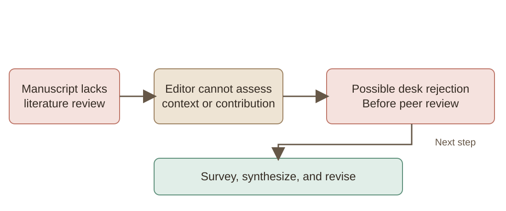

<!--
Hypothetical teaching example. A missing or inadequate review may lead to desk rejection, depending on venue criteria. The diagram describes a possible outcome, not an automatic rule.
A revision should connect the research question and contribution to relevant prior work, rather than simply adding more citations.
-->

<!--
Source: AY2025_lect2 - lit. survey.pptx, slide 27.
Original slide text (historical source, not verified current guidance):
Desk rejection: no literature review
Monday, October 13, 2025
RPW1: Session 1
27
Journal Editor/Program Chair
Image source: いらすとや
How can I find them?

You
You should search and find more than that number. Filter them out to find  proper ones.

Original illustration credit: いらすとや (Irasutoya).
-->

---
<!-- _class: media-slide -->

# Takeaway

- Be careful with literature review.
- Better find the latest publications.
- Don’t just cite the paper. Please read, understand and analyze it.
- If you cited a paper and wrote something wrong about it, your paper could be rejected.

<!--
Source: AY2025_lect2 - lit. survey.pptx, slide 28.
Original slide text (historical source, not verified current guidance):
Takeaway
Monday, October 13, 2025
RPW1: Session 2
28
Be careful with literature review.
Better find the latest publications.
Don’t just cite the paper. Please read, understand and analyze it.
If you cited a paper and wrote something wrong about it, your paper could be rejected.
Image source: いらすとや

Original illustration credit: いらすとや (Irasutoya).
-->

---

# Key Steps in a Literature Survey

1. Define the Scope
2. Search for Relevant Sources
3. Filter and Select Papers
4. Summarize and Synthesize Findings
5. Organize the Review

<!--
Source: AY2025_lect2 - lit. survey.pptx, slide 29.
Original slide text (historical source, not verified current guidance):
Key Steps in a Literature Survey
➊ Define the Scope
➋ Search for Relevant Sources
➌ Filter and Select Papers
➍ Summarize and Synthesize Findings
➎ Organize the Review
Monday, October 13, 2025
RPW1: Session 2
29
-->

---
<!-- _class: media-slide -->

# ➊ – Defining the Scope

- Narrow Your Focus:
  - Define a specific research question or problem.
  - Avoid covering an overly broad topic.
  - Not too narrow so you failed to find any match.
- Example: From artificial intelligence, narrow down to reinforcement learning for robotic navigation.

<!--
Source: AY2025_lect2 - lit. survey.pptx, slide 30.
Original slide text (historical source, not verified current guidance):
➊ – Defining the Scope
Narrow Your Focus: 
Define a specific research question or problem.
Avoid covering an overly broad topic.
Not too narrow so you failed to find any match.
Example: From artificial intelligence, narrow down to reinforcement learning for robotic navigation.
Monday, October 13, 2025
RPW1: Session 2
30
I want to find a car.
How many seats? Gasoline or diesel? How much are you willing to pay?

Additional original detail appears above in these speaker notes.
-->

---

# Searching for relevant sources

- Search scholarly databases using terms for your research question.
- Try synonyms and alternative terminology.
- Follow references and papers that cite relevant work.
- Evaluate the paper itself, including its methods and evidence.

<!--
Source: AY2025_lect2 - lit. survey.pptx, slide 31.
Original slide text (historical source, not verified current guidance):
➋ – Searching for Relevant Sources
Use databases: Google Scholar, IEEE Xplore, ACM Digital Library.
Select good papers: from top journals/conferences or written by reputable researchers
Use keywords: Tailor keywords for more accurate search results.
Use relevant paper references: check out the cited papers from a paper you read.
Example: Searching "reinforcement learning for robotic navigation" in Google Scholar.
Monday, October 13, 2025
RPW1: Session 2
31
-->

---
<!-- _class: media-slide -->

# ➋ – Searching on Google Scholar

Historical recording (2024).

<video controls preload="none" poster="images/image11.png"><source src="videos/media1.mp4" /></video>

[Open video](videos/media1.mp4)

---
<!-- _class: media-slide -->

# ➋ – Google Scholar: filtering the time

- Narrow down to a certain period to find the most notable one

<video controls preload="none" poster="images/image12.png"><source src="videos/media2.mp4" /></video>

[Open video](videos/media2.mp4)

---
<!-- _class: media-slide -->

# ➋ – Check the references of a good paper

- Assuming this is a good paper. Let’s check its references.

<video controls preload="none" poster="images/image13.png"><source src="videos/media3.mp4" /></video>

[Open video](videos/media3.mp4)

<!--
Source: AY2025_lect2 - lit. survey.pptx, slide 34.
Original slide text (historical source, not verified current guidance):
➋ – Check the references of a good paper
Monday, October 13, 2025
RPW1: Session 2
34
Assuming this is a good paper. Let’s check its references.
Extracted images: images/image13.png
-->

---

# Filtering and selecting papers

- Relevance to the research question
- Methods, evidence, and limitations
- Publication status and date
- Coverage of both foundational and recent work

<!--
Source: AY2025_lect2 - lit. survey.pptx, slide 35.
Original slide text (historical source, not verified current guidance):
➌ – Filtering and Selecting Papers
Criteria for Selecting Papers:
Relevance to your research question.
Recency and quality of the publication.
Citations and peer review status.
Example: 
Prioritize recent papers on “reinforcement learning for robotic navigation” published in top conferences like IEEE International Conference on Robotics and Automation.
Monday, October 13, 2025
RPW1: Session 2
35
-->

---
<!-- _class: media-slide -->

# ➌ – Filtering and Selecting Papers

- First, I search for the conference. Then, I search within the publication.

Historical recording (2024–2025).

<video controls preload="none" poster="images/image14.png"><source src="videos/media4.mp4" /></video>

[Open video](videos/media4.mp4)

<!--
Source: AY2025_lect2 - lit. survey.pptx, slide 36.
Original slide text (historical source, not verified current guidance):
➌ – Filtering and Selecting Papers
Monday, October 13, 2025
RPW1: Session 2
36
First, I search for the conference. Then, I search within the publication.
Extracted images: images/image14.png
-->

---
<!-- _class: media-slide -->

# ➌ – Filtering and Selecting Papers

- I can also ask Generative AI. However, the papers seem old. 
- Note: DO NOT consider the answers to be completely accurate

<video controls preload="none" poster="images/image15.png"><source src="videos/media5.mp4" /></video>

[Open video](videos/media5.mp4)

<!--
Source: AY2025_lect2 - lit. survey.pptx, slide 37.
Original slide text (historical source, not verified current guidance):
➌ – Filtering and Selecting Papers
Monday, October 13, 2025
RPW1: Session 2
37
I can also ask Generative AI. However, the papers seem old. There are no 2023 or 2024 papers
Note: The content is generated using ChatGPT (2024), DO NOT consider the answers to be completely accurate
Extracted images: images/image15.png
-->

---
<!-- _class: media-slide -->

# scite demonstration

- Historical walkthrough of a tool for reading and synthesizing papers.
- Verify generated statements against original sources.

<video controls preload="none" poster="images/image16.png"><source src="videos/media6.mp4" /></video>

[Open video](videos/media6.mp4)

<!--
Source: AY2025_lect2 - lit. survey.pptx, slide 38.
Original slide text (historical source, not verified current guidance):
scite_: a simple walkthrough
Monday, October 13, 2025
RPW1: Session 2
38
This is a Gen AI tool designed to assist you with reading and synthesizing papers.
More tools can be available in the future!
Extracted images: images/image16.png
-->

---
<!-- _class: media-slide -->

# Checking search results

- Try synonyms, such as “CPU” and “processor”.
- Check whether each paper addresses your research question.
- Verify AI-generated references and ask your supervisor when uncertain.

<!--
Source: AY2025_lect2 - lit. survey.pptx, slide 39.
Original slide text (historical source, not verified current guidance):
➌ – Filtering and Selecting Papers
Monday, October 13, 2025
RPW1: Session 2
39
Be aware that ChatGPT or generative AI may not be accurate. And it is trained on an old database.
Change the keyword to a different type of wording to have different results. For instance: use “CPU” instead of “processor”
Please check if the paper is relevant to the research problem.
If you are unclear, ask your supervisor about her/his opinions.
Image source: いらすとや

Original illustration credit: いらすとや (Irasutoya).
-->

---

# ➍ – Summarizing and Synthesizing Findings

- Summarize: Extract key insights from each paper.
- Synthesize: Combine insights to identify patterns and gaps.
- Example:
  - Synthesizing findings from various low-power methods for large language models.
  - We found this paper, and let’s try to summarize it: https://ieeexplore.ieee.org/stamp/stamp.jsp?arnumber=10549890

<!--
Source: AY2025_lect2 - lit. survey.pptx, slide 40.
Original slide text (historical source, not verified current guidance):
➍ – Summarizing and Synthesizing Findings
Summarize: Extract key insights from each paper.
Synthesize: Combine insights to identify patterns and gaps.
Example: 
Synthesizing findings from various low-power methods for large language models.
We found this paper, and let’s try to summarize it: https://ieeexplore.ieee.org/stamp/stamp.jsp?arnumber=10549890 
Monday, October 13, 2025
RPW1: Session 2
40
Original links:
https://ieeexplore.ieee.org/stamp/stamp.jsp?arnumber=10549890
-->

---
<!-- _class: media-slide -->

# ➍ – Quickly check the paper

- I first check the keywords (index terms) and check the abstract.
- Seem like a good fit for my topic.

<video controls preload="none" poster="images/image17.png"><source src="videos/media7.mp4" /></video>

[Open video](videos/media7.mp4)

<!--
Source: AY2025_lect2 - lit. survey.pptx, slide 41.
Original slide text (historical source, not verified current guidance):
➍ – Quickly check the paper
Monday, October 13, 2025
RPW1: Session 2
41
I first check the keywords (index terms) and check the abstract.
Seem like a good fit for my topic.
Extracted images: images/image17.png
-->

---
<!-- _class: media-slide -->

# ➍ – a Gen AI may help

- You can also ask Gen AI to summarize it.
- However, be careful, it may be incorrect. 

<video controls preload="none" poster="images/image18.png"><source src="videos/media8.mp4" /></video>

[Open video](videos/media8.mp4)

<!--
Source: AY2025_lect2 - lit. survey.pptx, slide 42.
Original slide text (historical source, not verified current guidance):
➍ – a Gen AI may help
Monday, October 13, 2025
RPW1: Session 2
42
You can also ask Gen AI to summarize it.
However, be careful, it may be incorrect. You'd better read it carefully after quickly checking it.
Extracted images: images/image18.png
-->

---
<!-- _class: media-slide -->

# ➍ – a Gen AI may help (cnt.)

- This is a summarization tool (Google Scholar PDF Reader) with AI summarization (Dev mode 2024)

<video controls preload="none" poster="images/image19.png"><source src="videos/media9.mp4" /></video>

[Open video](videos/media9.mp4)

<!--
Source: AY2025_lect2 - lit. survey.pptx, slide 43.
Original slide text (historical source, not verified current guidance):
➍ – a Gen AI may help (cnt.)
Monday, October 13, 2025
RPW1: Session 2
43
This is a summarization tool (Google Scholar PDF Reader) with AI summarization (Dev mode 2024)
Extracted images: images/image19.png
-->

---
<!-- _class: media-slide -->

# ➍ – a Gen AI may help (cnt.)

- This is notebooklm, which can help you with paper summarization and more.

<video controls preload="none" poster="images/image20.png"><source src="videos/media10.mp4" /></video>

[Open video](videos/media10.mp4)

<!--
Source: AY2025_lect2 - lit. survey.pptx, slide 44.
Original slide text (historical source, not verified current guidance):
➍ – a Gen AI may help (cnt.)
Monday, October 13, 2025
RPW1: Session 2
44
This is notebooklm, which can help you with paper summarization and more.
Extracted images: images/image20.png
-->

---
<!-- _class: media-slide -->

# Reading the full paper

- After checking relevance, read the paper carefully.
- Evaluate methods, evidence, and limitations.
- A venue label alone does not establish research quality.

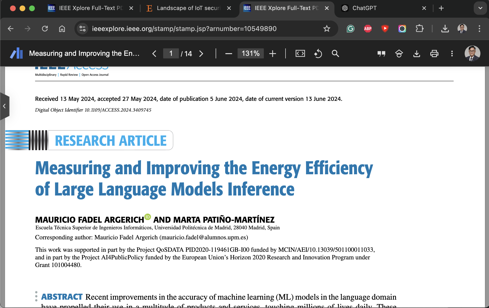

<!--
Source: AY2025_lect2 - lit. survey.pptx, slide 45.
Original slide text (historical source, not verified current guidance):
➍ – After feeling it fits your topic, read it
Monday, October 13, 2025
RPW1: Session 2
45
This paper seems to fit my topic. It is from IEEE Access to it is not top-tier but decent. Let me read it. You can check it from [this link].
Original links:
https://ieeexplore.ieee.org/stamp/stamp.jsp?arnumber=10549890
Extracted images: images/image21.png
-->

---
<!-- _class: media-slide -->

# ➍ – Don’t forget to take note

- I will use JabRef because it is like pure BibTex. But you can use Zotero or Mendeley or others.

Historical recording (2024–2025).

<video controls preload="none" poster="images/image22.png"><source src="videos/media11.mp4" /></video>

[Open video](videos/media11.mp4)

<!--
Source: AY2025_lect2 - lit. survey.pptx, slide 46.
Original slide text (historical source, not verified current guidance):
➍ – Don’t forget to take note
Monday, October 13, 2025
RPW1: Session 2
46
I will use JabRef because it is like pure BibTex. But you can use Zotero or Mendeley or others.
Extracted images: images/image22.png
-->

---
<!-- _class: media-slide -->

# ➍ – Don’t forget to take note

- You can search but also can import bibtex file s into the tool. I also can write some comments.

Historical recording (2024–2025).

<video controls preload="none" poster="images/image23.png"><source src="videos/media12.mp4" /></video>

[Open video](videos/media12.mp4)

<!--
Source: AY2025_lect2 - lit. survey.pptx, slide 47.
Original slide text (historical source, not verified current guidance):
➍ – Don’t forget to take note
Monday, October 13, 2025
RPW1: Session 2
47
You can search but also can import bibtex file s into the tool. I also can write some comments.
Extracted images: images/image23.png
-->

---
<!-- _class: media-slide -->

# ➍ – Don’t forget to take note

- When writing LaTeX, you can use Bibtex file for citation.
- The bibtex file is a text file and looks like this.

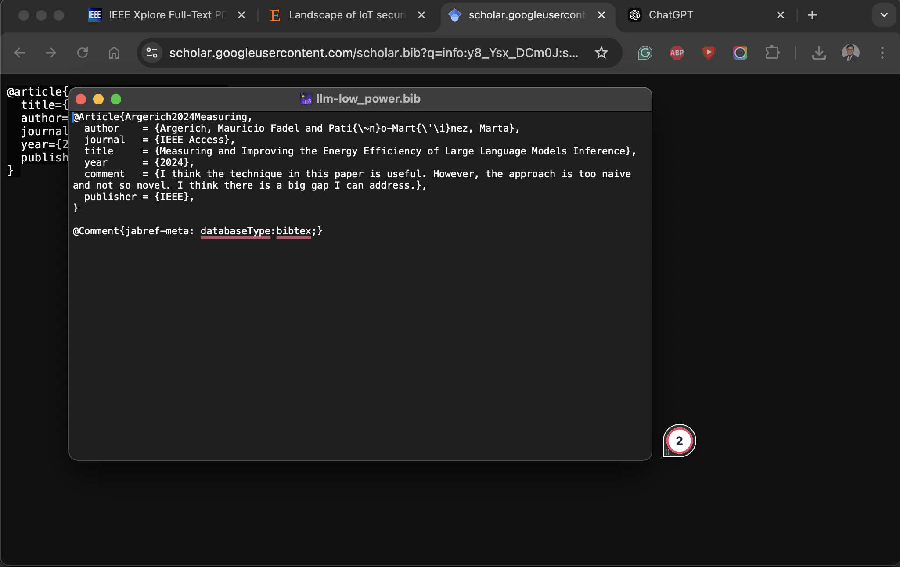

<!--
Source: AY2025_lect2 - lit. survey.pptx, slide 48.
Original slide text (historical source, not verified current guidance):
➍ – Don’t forget to take note
Monday, October 13, 2025
RPW1: Session 2
48
When writing LaTeX, you can use Bibtex file for citation.
The bibtex file is a text file and looks like this.
Extracted images: images/image24.png
-->

---
<!-- _class: media-slide -->

# ➍ – Filtering and Selecting Papers

- Please be well organized. Save the reference to your own database and give some comments.
- Please also check its references or find which papers cite that paper to explore more.
- Does it have some similarities with other works? We can group them together
- What is the gap that the paper failed to fill?

<!--
Source: AY2025_lect2 - lit. survey.pptx, slide 49.
Original slide text (historical source, not verified current guidance):
➍ – Filtering and Selecting Papers
Monday, October 13, 2025
RPW1: Session 2
49
Please be well organized. Save the reference to your own database and give some comments.
Please also check its references or find which papers cite that paper to explore more.
Does it have some similarities with other works? We can group them together
What is the gap that the paper failed to fill?
Image source: いらすとや

Original illustration credit: いらすとや (Irasutoya).
Additional original detail appears above in these speaker notes.
-->

---

# ➎ – Organizing the Survey

- Thematic Organization: Group studies by theme or topic.
- Methodological Organization: Compare techniques or approaches.
- Chronological Organization: Show progression of research over time.
- Example: Grouping research on image classification by method, such as CNN vs. transformer models.

<!--
Source: AY2025_lect2 - lit. survey.pptx, slide 50.
Original slide text (historical source, not verified current guidance):
➎ – Organizing the Survey
Thematic Organization: Group studies by theme or topic.
Methodological Organization: Compare techniques or approaches.
Chronological Organization: Show progression of research over time.
Example: Grouping research on image classification by method, such as CNN vs. transformer models.
Monday, October 13, 2025
RPW1: Session 2
50
-->

---
<!-- _class: media-slide -->

# A funny analogy

- I am God. I created so many animals before and I want to create a new one.
- Let’s do a ”literature survey”. I am searching for animals and organizing them into categories.

<!--
Source: AY2025_lect2 - lit. survey.pptx, slide 51.
Original slide text (historical source, not verified current guidance):
A funny analogy
Monday, October 13, 2025
RPW1: Session 2
51
I am God. I created so many animals before and I want to create a new one.
Let’s do a ”literature survey”. I am searching for animals and organizing them into categories.
Extracted images: images/image25.png
-->

---
<!-- _class: media-slide -->

# A funny analogy

- Let’s do Thematic Organization
- Cannot fly
- Can fly
- Originally, I can

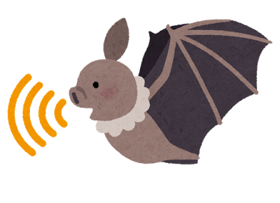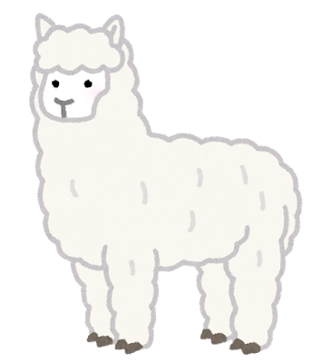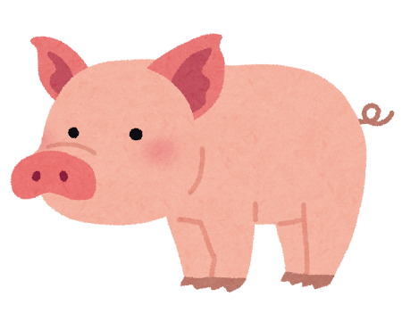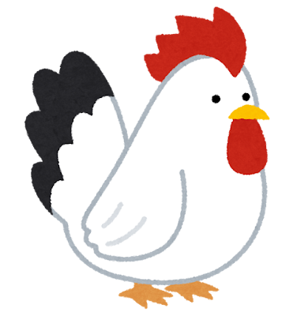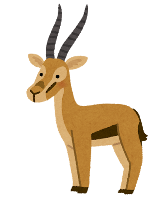

<!--
Source: AY2025_lect2 - lit. survey.pptx, slide 52.
Original slide text (historical source, not verified current guidance):
A funny analogy
Monday, October 13, 2025
RPW1: Session 2
52
Let’s do Thematic Organization
Cannot fly
Can fly
Originally, I can
Extracted images: images/image31.png, images/image26.png, images/image30.png, images/image25.png, images/image29.png, images/image28.png, images/image27.png
-->

---
<!-- _class: media-slide -->

# A funny analogy

- Let’s do Methodological Organization
- Natural
- Raised by human
- (Domesticated)
- …

<!--
Source: AY2025_lect2 - lit. survey.pptx, slide 53.
Original slide text (historical source, not verified current guidance):
A funny analogy
Monday, October 13, 2025
RPW1: Session 2
53
Let’s do Methodological Organization
Natural
Raised by human
(Domesticated)
…
Extracted images: images/image31.png, images/image26.png, images/image30.png, images/image25.png, images/image29.png, images/image28.png, images/image27.png
-->

---
<!-- _class: media-slide -->

# A funny analogy

- Let’s do Chronological Organization
- Now: Dog
- Long time ago: Wolf
- Time

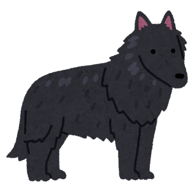

<!--
Source: AY2025_lect2 - lit. survey.pptx, slide 54.
Original slide text (historical source, not verified current guidance):
A funny analogy
Monday, October 13, 2025
RPW1: Session 2
54
Let’s do Chronological Organization
Now: Dog
Long time ago: Wolf
Time
Extracted images: images/image32.png, images/image25.png, images/image33.png
-->

---

# Choosing an organization

- Group studies by topic or by method, depending on the question.
- Use chronological order when development over time matters.
- Explain connections and differences within each group.

<!--
Source: AY2025_lect2 - lit. survey.pptx, slide 55.
Original slide text (historical source, not verified current guidance):
➎ – Organizing the Survey (cnt.)
Thematic Organization and Methodological Organization are interchangeable
If the theme is only one, you do not need to split.
Chronological Organization is rarely used in SCE. However, you can simply use the chronological order in thematic/methodological organization.
For example, when talking about training methods for DNN, you can talk about early works first, then move to the recent ones.
Monday, October 13, 2025
RPW1: Session 2
55
-->

---
<!-- _class: media-slide -->

# ➎ – Takeaway

- You need to classify all of the references
- When writing a paper, use the classifications as the guidance for writing.
- Image source: いらすとや
- You can find out the “gap” after organizing all of the references.
- That’s why “litterature survey” is important.

<!--
Source: AY2025_lect2 - lit. survey.pptx, slide 56.
Original slide text (historical source, not verified current guidance):
➎ – Takeaway
Monday, October 13, 2025
RPW1: Session 2
56
You need to classify all of the references
When writing a paper, use the classifications as the guidance for writing.
Image source: いらすとや
You can find out the “gap” after organizing all of the references.
That’s why “litterature survey” is important.

Original illustration credit: いらすとや (Irasutoya).
-->

---

# Common methods

- Assessing the Quality of Research
- Annotating and Summarizing Articles
- Identifying Research Gaps
- Synthesizing Researches
- Common mistakes

<!--
Source: AY2025_lect2 - lit. survey.pptx, slide 57.
Original slide text (historical source, not verified current guidance):
Common methods
Assessing the Quality of Research
Annotating and Summarizing Articles
Identifying Research Gaps
Synthesizing Researches
Common mistakes
Monday, October 13, 2025
RPW1: Session 2
57
-->

---

# Assessing research quality

- Check whether the methods support the claims.
- Examine evidence, comparisons, and limitations.
- Consider reproducibility and access to artifacts.
- Citation counts and author reputation do not replace critical reading.

<!--
Source: AY2025_lect2 - lit. survey.pptx, slide 58.
Original slide text (historical source, not verified current guidance):
Assessing the Quality of Research
Criteria: 
Check the previous session to know the top journal/conference.
Published in reputable journals/conferences.
High citation count. Be careful as citations can be manipulated.
Open-source: stars or forks on GitHub or number of downloads.
Peer-reviewed or even open-reviewed.
Authors’ reputation.
Example: Comparing papers from top-tier conferences like NeurlPS versus less established sources.
Monday, October 13, 2025
RPW1: Session 2
58
-->

---
<!-- _class: media-slide -->

# OpenReview demonstration

- Historical walkthrough of publicly available reviews.
- Review availability and procedures vary by venue.

Historical recording (2024–2025).

<video controls preload="none" poster="images/image34.png"><source src="videos/media13.mp4" /></video>

[Open video](videos/media13.mp4)

<!--
Source: AY2025_lect2 - lit. survey.pptx, slide 59.
Original slide text (historical source, not verified current guidance):
Assessing the Quality of Research
Monday, October 13, 2025
RPW1: Session 2
59
Openreview.net is a good source to know how a paper is reviewed in top conference
Extracted images: images/image34.png
-->

---
<!-- _class: media-slide -->

# Let’s ask ChatGPT

- I asked ChatGPT and will ask my supervisor if they are top-tier journals or conferences.

Historical recording (2024–2025).

<video controls preload="none" poster="images/image35.png"><source src="videos/media14.mp4" /></video>

[Open video](videos/media14.mp4)

<!--
Source: AY2025_lect2 - lit. survey.pptx, slide 60.
Original slide text (historical source, not verified current guidance):
Let’s ask ChatGPT
Monday, October 13, 2025
RPW1: Session 2
60
I asked ChatGPT and will ask my supervisor if they are top-tier journals or conferences.
Extracted images: images/image35.png
-->

---
<!-- _class: media-slide -->

# Judging papers

- Read the evidence before judging research quality.
- Identify relevant venues with your supervisor.
- Include useful work beyond a fixed venue list.
- Verify any AI-generated advice.

<!--
Source: AY2025_lect2 - lit. survey.pptx, slide 61.
Original slide text (historical source, not verified current guidance):
Takeaways
Monday, October 13, 2025
RPW1: Session 2
61
It is not easy to say if the paper is good or not. You may not understand it at all to judge
Please also identify the list of reputable conferences/journals in your fields. Try only read papers that list.
Image source: いらすとや
If you are in doubt, ask your supervisor.
Asking ChatGPT is not a bad idea. But please verify after asked.

Original illustration credit: いらすとや (Irasutoya).
-->

---

# Annotating and Summarizing Articles

- Purpose:
- Make concise notes and highlight key points for later reference.
- Strategies:
- Summarize each article in a few sentences.
- Highlight methodologies, results.

<!--
Source: AY2025_lect2 - lit. survey.pptx, slide 62.
Original slide text (historical source, not verified current guidance):
Annotating and Summarizing Articles
Purpose: 
Make concise notes and highlight key points for later reference.
Strategies:
Summarize each article in a few sentences.
Highlight methodologies, results.
Monday, October 13, 2025
RPW1: Session 2
62
-->

---
<!-- _class: media-slide -->

# Example of Annotating and Summarizing

- Let’s try this paper (please open it yourself): https://ieeexplore.ieee.org/stamp/stamp.jsp?arnumber=10549890
- Scan this code

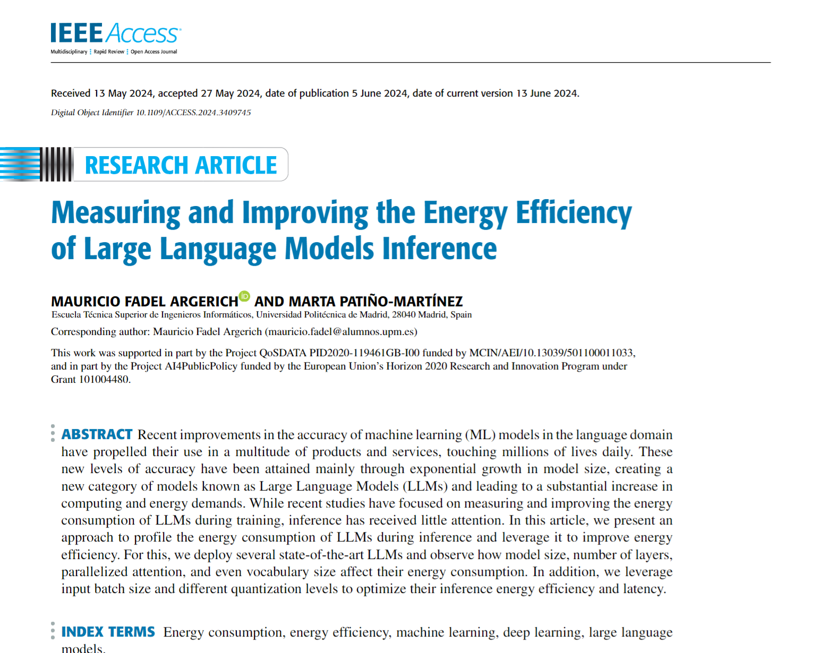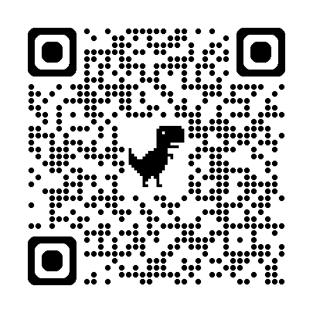

<!--
Source: AY2025_lect2 - lit. survey.pptx, slide 63.
Original slide text (historical source, not verified current guidance):
Example of Annotating and Summarizing
Let’s try this paper (please open it yourself): https://ieeexplore.ieee.org/stamp/stamp.jsp?arnumber=10549890

Monday, October 13, 2025
RPW1: Session 2
63
Scan this code
Original links:
https://ieeexplore.ieee.org/stamp/stamp.jsp?arnumber=10549890
Extracted images: images/image36.png, images/image37.png
-->

---

# Checking an AI-generated summary

- The source deck includes a ChatGPT summary from October 2024.
- Compare it with the original paper.
- Which claims describe the method, results, or interpretation?

<!--
Source: AY2025_lect2 - lit. survey.pptx, slide 64.
Original slide text (historical source, not verified current guidance):
Example of Annotating and Summarizing (cnt.)
Summarize in few sentences:
ChatGPT (2024/10): “The article presents EnergyMeter, a software tool developed to measure and optimize the energy consumption of large language models (LLMs) during inference. By profiling energy use across CPU, GPU, memory, and storage, the study identifies that model size, architecture, batch size, and quantization significantly impact energy efficiency. Key findings suggest that increasing batch size and using quantized models can substantially reduce energy usage, with the GPU being the primary consumer. This research provides actionable insights for minimizing the environmental footprint of AI applications.”
Monday, October 13, 2025
RPW1: Session 2
64
Original AI summary and numerical assertions retained for source comparison only. Verify against the original paper before teaching these as results.
-->

---

# A concise summary

- Identify the research problem and contribution.
- State the method and evaluation setting.
- Report findings with their conditions and limitations.

<!--
Source: AY2025_lect2 - lit. survey.pptx, slide 65.
Original slide text (historical source, not verified current guidance):
Example of Annotating and Summarizing (cnt.)
Shorter summarization:
They made a tool developed to estimate energy consumption of large language models (LLMs) during inference.  no training.
Model size, architecture, batch size, and quantization significantly impact energy efficiency.  this is obvious, no a new finding
Increasing batch size and using quantized models can substantially reduce energy usage 
Monday, October 13, 2025
RPW1: Session 2
65
Original AI summary and numerical assertions retained for source comparison only. Verify against the original paper before teaching these as results.
-->

---

# Methodology reading activity

- How does the paper measure energy consumption?
- Which models, devices, workloads, and settings does it evaluate?
- Which comparisons support the main claims?

<!--
Source: AY2025_lect2 - lit. survey.pptx, slide 66.
Original slide text (historical source, not verified current guidance):
Example of Annotating and Summarizing (cnt.)
Methodology:
They combined existing tool to form a tool to estimate power consumption. 
Their models and setup are varied between small and big size.
For evaluation, they varied model size, architecture, batch size and quantization.
They test with QA application to measure the energy

Monday, October 13, 2025
RPW1: Session 2
66
Original AI summary and numerical assertions retained for source comparison only. Verify against the original paper before teaching these as results.
-->

---

# Results reading activity

- Find the batch-size and quantization comparisons.
- Check the energy metric, baseline, and experimental conditions.
- Verify numerical claims against the original tables or figures.

<!--
Source: AY2025_lect2 - lit. survey.pptx, slide 67.
Original slide text (historical source, not verified current guidance):
Example of Annotating and Summarizing (cnt.)
Result:
Increasing batch size reduced energy consumption up to 20x for smaller models (e.g., Pythia-70M) and about 3x for larger models (e.g., Pythia-6.9B). 
Switching from 16-bit to 4-bit quantization on the Llama 2-7B model reduced energy consumption by approximately 2x.
During inference in a typical question-answering application, GPUs accounted for 86% of the total energy consumption, followed by CPUs at 11%, with memory and storage each using less than 2%.
Monday, October 13, 2025
RPW1: Session 2
67
Original AI summary and numerical assertions retained for source comparison only. Verify against the original paper before teaching these as results.
-->

---

# Identifying Research Gaps

- Purpose:
- Find unexplored or under-explored areas in the literature.
- Look for:
- Contradictory findings.
- Areas that lack comprehensive testing or verification.

<!--
Source: AY2025_lect2 - lit. survey.pptx, slide 68.
Original slide text (historical source, not verified current guidance):
Identifying Research Gaps
Purpose: 
Find unexplored or under-explored areas in the literature.
Look for:
Contradictory findings.
Areas that lack comprehensive testing or verification.
Monday, October 13, 2025
RPW1: Session 2
68
-->

---

# Limitations and possible follow-up questions

- How far do the findings generalize across devices and workloads?
- What trade-offs between energy use and output quality need evaluation?
- Which questions lie outside this paper’s scope?
- Check related work before calling an unanswered question a gap.

<!--
Source: AY2025_lect2 - lit. survey.pptx, slide 69.
Original slide text (historical source, not verified current guidance):
Example of Identifying Research Gaps
Let’s continues the previous paper:  https://ieeexplore.ieee.org/stamp/stamp.jsp?arnumber=10549890
Gaps or limitations:
It is limited to a set of devices and cannot be generalized for other devices.
The evaluation is too general and cannot analyze which part consume the most power or contribute the most to the overall accuracy.
The increase of batch size and reduce quantization is quite naïve or obvious. This has been done before and we may need a further investigation in this topic.
It is only for inference, so low-power for training is underexplored.
Monday, October 13, 2025
RPW1: Session 2
69
Original links:
https://ieeexplore.ieee.org/stamp/stamp.jsp?arnumber=10549890
Original AI summary and numerical assertions retained for source comparison only. Verify against the original paper before teaching these as results.
-->

---

# Research gaps across papers

- Compare the scope and limitations of multiple studies.
- Look for a recurring unresolved question.
- Define a feasible problem supported by the literature.

<!--
Source: AY2025_lect2 - lit. survey.pptx, slide 70.
Original SmartArt labels: Paper #1’s gap / Paper #2’s gap / Paper #3’s gap / Paper #4’s gap
Original slide text (historical source, not verified current guidance):
Identifying Research Gaps
Monday, October 13, 2025
RPW1: Session 2
70

This is the common research gap
-->

---
<!-- _class: media-slide -->

# Takeaway

- Find as much as papers as you can in a specific topic.
- Identifying the common gap is difficult. Also, it could be a difficult problem to be solved.
- Image source: いらすとや
- If you missed some paper, you may propose a paper idea that is already proposed before.

<!--
Source: AY2025_lect2 - lit. survey.pptx, slide 71.
Original slide text (historical source, not verified current guidance):
Takeaway
Monday, October 13, 2025
RPW1: Session 2
71
Find as much as papers as you can in a specific topic.
Identifying the common gap is difficult. Also, it could be a difficult problem to be solved. 
Image source: いらすとや
If you missed some paper, you may propose a paper idea that is already proposed before.
You may want to break the common gap down into smaller problem to address.

Original illustration credit: いらすとや (Irasutoya).
Additional original detail appears above in these speaker notes.
-->

---

# Synthesizing Researches

- Purpose:
- Create a cohesive narrative from different studies.
- Key Tips:
- Group studies by common findings or contradictions.
- Discuss emerging trends.
- Tie the findings to your own research.

<!--
Source: AY2025_lect2 - lit. survey.pptx, slide 72.
Original slide text (historical source, not verified current guidance):
Synthesizing Researches
Purpose: 
Create a cohesive narrative from different studies.
Key Tips:
Group studies by common findings or contradictions.
Discuss emerging trends.
Tie the findings to your own research.
Monday, October 13, 2025
RPW1: Session 2
72
-->

---
<!-- _class: media-slide -->

# scite demonstration

- Historical walkthrough, also shown earlier in this session.
- Check original papers before using a generated synthesis.

Historical recording (2024–2025).

<video controls preload="none" poster="images/image16.png"><source src="videos/media6.mp4" /></video>

[Open video](videos/media6.mp4)

<!--
Source: AY2025_lect2 - lit. survey.pptx, slide 73.
Original slide text (historical source, not verified current guidance):
scite ai: a simple walkthrough
Monday, October 13, 2025
RPW1: Session 2
73
This is a new Gen AI tool to help you with paper reading and synthesizing.
More tools can be available in the future!
Extracted images: images/image16.png
-->

---

# Common mistakes

- A scope that is too broad or too narrow
- Uncritical source selection
- A list of summaries without synthesis
- A gap claim based on an incomplete search

<!--
Source: AY2025_lect2 - lit. survey.pptx, slide 74.
Original slide text (historical source, not verified current guidance):
Common Mistakes to Avoid
Pitfalls:
Being too broad or unfocused.
Being too narrowed or overspecific.
Failing to evaluate sources.
Listing studies without synthesis.
Example: 
A review on AI ethics that includes too many subtopics without clear connections.
A search on low-power techniques for LLM training may includes 4/5 papers (as of 2024) as it is too narrow. You better expand to low-power techniques for AI training.
Monday, October 13, 2025
RPW1: Session 2
74
-->

---

# Managing literature

- Keep references in a shared, searchable library.
- Attach PDFs and record notes on methods, findings, and limitations.
- Use consistent tags and citation keys.

<!--
Source: AY2025_lect2 - lit. survey.pptx, slide 75.
Original slide text (historical source, not verified current guidance):
Tools for Managing and Organizing Literature
Reference Management: 
Simple approach: Use BibTeX for Latex or Reference management in MSWord
Better: Use tools like Jabref, Zotero, Mendeley, or EndNote.
Jabref was shown in prior slides.
Allow you to have categories, take notes, link to files (paper/summary/slide)
Keyword Search and Filters: 
Use Google Scholar, IEEE Xlpore and others.
Try to optimize search results: add time, more keyword, add venue.
Annotating: 
Add notes and key findings to the reference management tools.
Write your own report about key finding.

Monday, October 13, 2025
RPW1: Session 2
75
-->

---
<!-- _class: media-slide -->

# A simple walkthrough of JabRef/Zotero

- URL: https://www.jabref.org/ & https://www.zotero.org/

<!--
Source: AY2025_lect2 - lit. survey.pptx, slide 76.
Original slide text (historical source, not verified current guidance):
A simple walkthrough of JabRef/Zotero
URL: https://www.jabref.org/ & https://www.zotero.org/

Monday, October 13, 2025
RPW1: Session 2
76
Original links:
https://www.zotero.org/
https://www.jabref.org/

-->

---

# Consistent citation keys

- The same paper may arrive with different BibTeX keys.
- Example: `argerich2024measuring` and `10549890`.
- Match records by DOI and bibliographic details, then merge duplicates.

<!--
Source: AY2025_lect2 - lit. survey.pptx, slide 77.
Original slide text (historical source, not verified current guidance):
Cooperative Reference Management Style
To have the same management style in a team is critical
For example, this paper: https://ieeexplore.ieee.org/abstract/document/10549890/

Monday, October 13, 2025
RPW1: Session 2
77
Google Scholar
IEEE Xplore
@article{argerich2024measuring,
  title={Measuring and Improving the Energy Efficiency of Large Language Models Inference},
  author={Argerich, Mauricio Fadel and Pati{\~n}o-Mart{\'\i}nez, Marta},
  journal={IEEE Access},
  year={2024},
  publisher={IEEE}
}
@ARTICLE{10549890,
  author={Argerich, Mauricio Fadel and Patiño-Martínez, Marta},
  journal={IEEE Access}, 
  title={Measuring and Improving the Energy Efficiency of Large Language Models Inference}, 
  year={2024},
  volume={12},
  number={},
  pages={80194-80207},
  keywords={Energy measurement;Energy consumption;Training;Graphics processing units;Software measurement;Computational modeling;Machine learning;Large language models;Energy consumption;energy efficiency;machine learning;deep learning;large language models},
  doi={10.1109/ACCESS.2024.3409745}}

Different ID!
Original links:
https://ieeexplore.ieee.org/abstract/document/10549890/
-->

---

# Cooperative Reference Management Style

- A-san, B-san, and C-san co-write a paper.
- A-san found the paper via Google Scholar and cite it in LaTeX with \cite{argerich2024measuring}
- B-san found the paper via IEEE Xplore and cite it in LaTeX with \cite{10549890}
- C-san found the paper and manually make it BiBTeX and  \cite{agoodpaper}
-  The paper is cited thrice.
- Q: What should we do?

<!--
Source: AY2025_lect2 - lit. survey.pptx, slide 78.
Original slide text (historical source, not verified current guidance):
Cooperative Reference Management Style
A-san, B-san, and C-san co-write a paper.
A-san found the paper via Google Scholar and cite it in LaTeX with \cite{argerich2024measuring} 
B-san found the paper via IEEE Xplore and cite it in LaTeX with \cite{10549890}
C-san found the paper and manually make it BiBTeX and  \cite{agoodpaper}

 The paper is cited thrice. 
Q: What should we do?
Monday, October 13, 2025
RPW1: Session 2
78
-->

---

# Takeaways

- Define a focused scope and search thoroughly.
- Read critically and connect findings across studies.
- Keep organized notes and accurate references.
- Use the review to explain your research contribution.

<!--
Source: AY2025_lect2 - lit. survey.pptx, slide 79.
Original slide text (historical source, not verified current guidance):
Take home with you
A literature survey is crucial for understanding the existing landscape of research.
Try to search on top-level journals or conferences in your field.
Learn techniques to critically read, evaluate, and identify gaps in research papers.
Stay organized:
Use management tools (e.g., Zotero, Mendeley) to organize papers.
Take detailed notes for easy reference and analysis.
Stick with our motto: “to Advance Knowledge for Humanity”
Monday, October 13, 2025
RPW1: Session 2
79
Investigate top journals and conferences in your field.

-->

---

# Creativity and synthesis

- Connections across existing ideas can inspire new questions.
- A literature review gives those connections evidence and context.

<!--
Source: AY2025_lect2 - lit. survey.pptx, slide 80.
Original slide text (historical source, not verified current guidance):
One more thing
“Creativity is just connecting things. When you ask creative people how they did something, they feel a little guilty because they didn’t really do it, they just saw something. It seemed obvious to them after a while. That’s because they were able to connect experiences they’ve had and synthesize new things. And the reason they were able to do that was that they’ve had more experiences or they have thought more about their experiences than other people.” 
						– Steve Jobs

Monday, October 13, 2025
RPW1: Session 2
80

Creativity 
is
connecting
Thing
 just 
Original quotation attribution retained above. Quotation omitted from student-facing slide pending source verification.
-->

---

# Assignment 2: Literature Survey

- Check current ELMS instructions for requirements and deadlines.

<!--
Source: AY2025_lect2 - lit. survey.pptx, slide 81.
Original slide text (historical source, not verified current guidance):
Assignment 2 – Literature Survey
Monday, October 13, 2025
RPW1: Session 2
81
Please check the ELMS
-->

---

# Q&A

- Questions about literature surveys and reviews?

<!--
Source: AY2025_lect2 - lit. survey.pptx, slide 82.
Original slide text (historical source, not verified current guidance):
Thank you for your attention!Let’s have Q&A
Monday, October 13, 2025
RPW1: Session 2
82
-->
